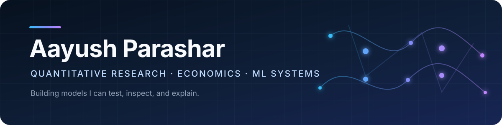

  

  <a href="mailto:aayush.parashar@duke.edu">Email</a>
  &nbsp;•&nbsp;
  <a href="https://github.com/meowcat234of-a11y?tab=repositories">All repositories</a>

I'm interested in economics, quantitative finance, and machine learning—mostly
the parts where a model has to survive contact with real code. I build small,
auditable projects to test ideas and understand where the assumptions matter.

### Selected work

**[Liquidity Arbitrage Engine](https://github.com/meowcat234of-a11y/liquidity-arb-engine)**
— limit-order-book simulation, market making, and synthetic order flow.

**[Algorithmic Auction Dynamics](https://github.com/meowcat234of-a11y/algorithmic-auction-dynamics)**
— adaptive bidding, auction simulation, and GPV structural estimation.

**[Macro Labor Automation Evaluation](https://github.com/meowcat234of-a11y/macro-labor-automation-eval)**
— staggered difference-in-differences, synthetic control, and reproducible data.

**[Venture Graph Transformer](https://github.com/meowcat234of-a11y/venture-graph-transformer)**
— transformer internals, relationship graphs, and an interactive explorer.

`Python` · `PyTorch` · `pandas` · `SciPy` · `NetworkX` · `Streamlit` · `DVC`

I keep the setup reproducible, test the parts that are easy to get wrong, and
write down the limits of each project.
